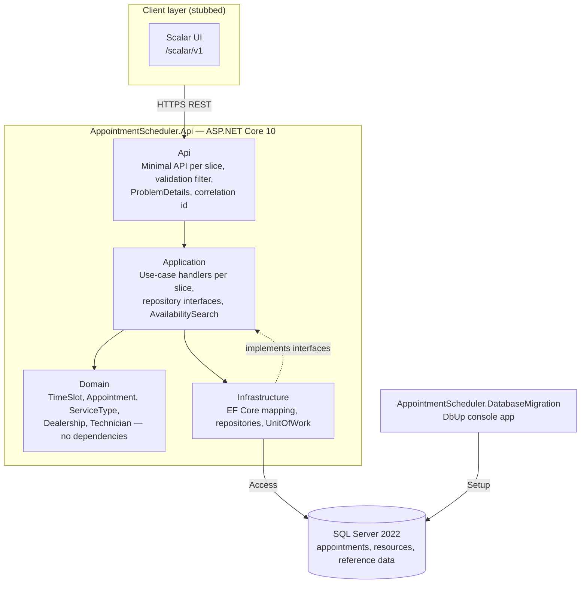
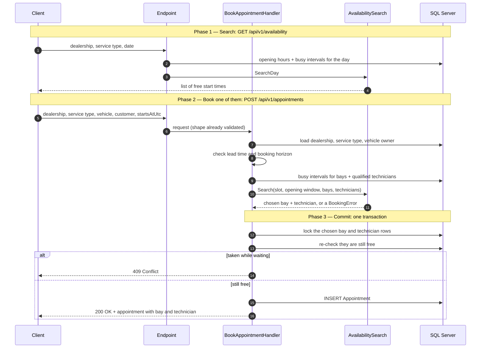

# System Design Document

**Keyloop Technical Assessment — Scenario A: The Unified Service Scheduler**

Backend implementation track. A dealership has a finite number of service bays and technicians, each
qualified for different work; a service occupies **one bay and one technician for its entire
duration**. This API decides whether a requested appointment can be honoured, allocates both
resources, and persists the booking.

Build and run instructions, scope, and the AI Collaboration Narrative are in the
[README](../README.md). Full DDL is in [data-model.md](data-model.md); the eighteen design problems
with the options considered for each are in [design-decisions.md](design-decisions.md).

| The brief's three core requirements | Met by |
| --- | --- |
| Request an appointment for a specific vehicle, service type, dealership and desired time | `POST /api/v1/appointments` |
| Before confirming, check a bay **and** a qualified technician are free for the **entire** duration | `AvailabilitySearch.Search` — §3 |
| On success persist an Appointment associating customer, vehicle, technician and bay | `Appointment.Book` + composite foreign keys |

---

## 1. Architecture diagram


---

## 2. Component roles

| Component | Responsibility |
| --- | --- |
| **Domain** | The rules, with nothing else attached: `TimeSlot` (the overlap rule), `Appointment` (guarded status transitions, `OccupyingStatuses`), `ServiceType.Duration`, `Dealership.OpeningWindowOn`, `Technician.IsQualifiedFor`. Zero project references, zero NuGet packages, so its tests need no setup at all. |
| **Application** | One handler per use case, each in its own slice folder beside the narrow repository interface it declares. Owns `AvailabilitySearch` — the pure function that both the day view and the booking path call, so the two can never disagree about what "free" means. |
| **Infrastructure** | `AppointmentDbContext` — mapping only, and the one place the concurrency `Version` is incremented. Repositories that return materialised lists rather than `IQueryable`, so EF Core's translation rules stay behind the seam. `UnitOfWork` owns the transaction boundary. |
| **Api** | One endpoint class per slice under `/api/v1`, a FluentValidation endpoint filter, RFC 7807 error mapping, correlation-id middleware. No business rules. |
| **DatabaseMigration** | Standalone DbUp console app referencing no other project. `Schema/` and reference data run everywhere; `Demo/` only with `--demo`. Its `DatabaseMigrator.Run` is what the integration tests call, so tests provision exactly the way production does. |
| **SQL Server** | The system of record, and the enforcer of the invariants the application cannot be trusted to hold alone: composite foreign keys, the interval check constraint, and the filtered indexes that serve the overlap query. |

### 2.1 How the components are organised

Clean Architecture sets the project boundaries; vertical slicing sets the folder layout inside each, so
one feature is the same folder name repeated across projects rather than three different folders:

```
Features/Booking/  →  BookAppointmentEndpoint.cs      (Api)
                      BookAppointmentHandler.cs       (Application)
                      IAppointmentRepository.cs       (Application)
                      AppointmentRepository.cs        (Infrastructure)
```

---

## 3. Data flow

### 3.1 Booking a specific slot — `POST /api/v1/appointments`

The client normally makes two calls: one to see which slots are free, then one to take a specific one.



### 3.2 The flow step by step

Step numbers match the diagram.

**Search first (steps 1–4).** The availability endpoint takes a dealership, a service type and a local
date. It works out when the dealership is open that day, fetches what every bay and every qualified
technician is already busy with, and returns the start times where a bay *and* a qualified technician
are both free for the service's whole duration. The client picks one of those start times. This answer
is advisory — nothing is reserved by looking — which is why the booking path checks again rather than
trusting it.

**Request a specific slot (steps 5–6).** The POST carries the dealership, service type, vehicle,
customer and the single start time the client chose. Before the handler runs, the endpoint has already
checked the shape of the request — required fields present and well-formed — and rejects anything
malformed with **400 Bad Request — invalid request body**, naming the offending field. The endpoint
holds no business rules; it just passes the request on.

**Validate what can never succeed (steps 7–8).**

- **Step 7 — the request refers to real things.** The dealership must exist, since it supplies the
  opening hours and time zone; the service type must exist, since its duration is what turns a single
  instant into an interval; and the vehicle must belong to the stated customer. Any miss returns
  **404 Not Found — dealership, service type or vehicle does not exist**, naming which one. Checking
  here means the caller gets a clear answer instead of a database constraint error at the very end.
- **Step 8 — the time is bookable at all.** A start that is too soon is rejected against the minimum
  lead time, and one too far out against the booking horizon. Both compare against an injected clock,
  so tests can fix "now". Either failure returns **422 Unprocessable Entity — the requested time is
  outside the bookable range**: retrying the identical request cannot help.

**Find a bay and a technician (steps 9–10).**

- **Step 9 — fetch what is busy.** The chosen instant becomes a start-to-end interval, its length taken
  from the service duration. Two queries collect the busy intervals: one for the dealership's bays, one
  for technicians who hold every skill the service requires. Two queries in total, each an index seek,
  not one query per candidate.
- **Step 10 — pick a pair.** The search confirms the slot sits inside the opening window and ends
  before closing, then looks for a bay and a qualified technician free for the *entire* interval. Bays
  and technicians are searched independently, because choosing one does not constrain the other. It
  returns the pair to allocate, or **422 Unprocessable Entity — outside opening hours**, or
  **409 Conflict — no bay or no qualified technician is free**. This is the same search step 3 ran, so
  the two endpoints cannot disagree about what "free" means.

**Commit (steps 11–15).** Everything from here runs inside one transaction.

- **Step 11 — lock the two rows.** The chosen bay and technician rows are locked exclusively, always in
  ascending id order — two transactions locking the same pair in opposite orders would deadlock. A
  competing booking for the same bay now waits here until this transaction finishes.
- **Step 12 — re-check under the lock.** The step 10 answer was read without a lock and may already be
  stale. With the rows held, the same questions are asked again against state that can no longer
  change: is the bay still free, is the technician still free, and does this vehicle already have an
  overlapping appointment.
- **Step 13 — lost the race.** If a competitor booked first, the request is refused with
  **409 Conflict — the slot was taken while this request was waiting**, carrying a machine-readable
  reason, and the conflict counter is incremented with that reason.
- **Step 14 — write.** Otherwise the appointment's end time is derived from the service duration and
  the row is inserted. Committing the transaction releases the locks.
- **Step 15 — respond.** **200 OK** with the appointment, including which bay and which technician were
  allocated.

## 4. Technology choices with justifications

| Choice | Why |
| --- | --- |
| **.NET 10**, Minimal API | The latest version, and an LTS one — support runs for three years, so the project does not need re-targeting soon. .NET 9 would already be out of support. Minimal API because a handful of endpoints does not need controllers. |
| **SQL Server 2022** | The obvious relational choice on the Windows/.NET stack, and the one most likely already running where this system would be deployed. Bookings are relational data with hard constraints, so a relational database is the right shape. |
| **DbUp** for schema, **EF Core 10** for mapping | Schema as plain SQL scripts that a DBA can read and review, versus generated migrations that are harder to check. It also means the API never needs permission to change the database schema. EF Core is left to do what it is good at — mapping rows to objects. |
| **Repository per slice** | Each handler gets a small interface with only the methods it uses, so tests can swap in a fake and run without a database. Most of the suite finishes in about a second, which keeps it worth running. |
| **`TimeProvider`** (BCL) | Two rules compare against the current time, so tests need to control "now". .NET already ships this, along with a fake for tests — no reason to write one. |
| **FluentValidation** | Keeps "is this request well-formed" at the edge and separate from "is this booking allowed", which stays in the domain. Rules are declarative and easy to read. |
| **Serilog + OpenTelemetry** | Logs as JSON so a log tool can query them, and traces in a vendor-neutral format so any monitoring vendor can be plugged in later by configuration rather than code changes. |
| **xUnit v3 + Testcontainers.MsSql** | Runs the tests against a real SQL Server in a container. Locking and constraint behaviour is the whole point here, and an in-memory database does not have either. |
| **FluentAssertions 7.x** | Version 8 requires a paid licence for commercial use, so the last free version is pinned. |

---

## 5. Observability strategy

### 5.1 What a trace carries

Every request produces one trace. ASP.NET Core and EF Core instrumentation supply the HTTP and SQL
spans for free; the booking path adds three of its own, each tagged with the fields below.

| Field | Set on | Value |
| --- | --- | --- |
| `correlation.id` | every span, and every log line as `CorrelationId` | Taken from the `X-Correlation-Id` request header, or generated if absent. Echoed back in the response header and in the error body. |
| `dealership.id` | all three booking spans | Which dealership the request is for. |
| `service.duration_minutes` | validate, search | How long the requested service takes — the number that turns one instant into an interval. |
| `candidates.bays` | search | How many bays were considered. |
| `candidates.technicians` | search | How many qualified technicians were considered. |
| `http.request.method`, `url.path`, `http.response.status_code` | HTTP span | Standard, from ASP.NET Core instrumentation. |
| `db.statement`, `db.system` | SQL spans | Standard, from EF Core instrumentation. |

The three booking spans are `booking.validate`, `booking.search_resources` and `booking.commit`, so
the trace shows which stage the time went to.

Two counters are emitted alongside: `bookings_confirmed_total`, and `booking_conflicts_total` tagged
with `reason` — the specific refusal, such as `NoServiceBayAvailable` or `OutsideOpeningHours`.

### 5.2 An example

A client posts a booking with `X-Correlation-Id: 7f3a…`, and another customer takes the last free bay
a moment earlier. The shape of the trace — spans and tags, no timings, since none have been measured
yet:

```
POST /api/v1/appointments                          correlation.id=7f3a…
                                                   http.response.status_code=409
├─ booking.validate                                dealership.id=a91c…
│                                                  service.duration_minutes=90
│  ├─ SELECT Dealerships
│  └─ SELECT ServiceTypes
├─ booking.search_resources                        dealership.id=a91c…
│                                                  candidates.bays=3
│                                                  candidates.technicians=2
│  ├─ SELECT bay occupancy
│  └─ SELECT technician occupancy
└─ booking.commit                                  dealership.id=a91c…
   ├─ UPDATE ServiceBays, Technicians              ← blocks here while the other transaction holds the row
   └─ SELECT re-check
```

The response is `409 Conflict` with `X-Correlation-Id: 7f3a…` in the header and in the body, and
`booking_conflicts_total{reason="NoServiceBayAvailable"}` is incremented.

What this structure buys: the search span records that three bays and two technicians were considered,
so the request was viable when it was checked. If most of the request's time sits in `booking.commit`
rather than in the two search queries, the request was waiting on a row lock — which is what losing a
race looks like, and is neither a slow query nor a bug. Default HTTP instrumentation alone cannot tell
those apart, because it produces one span for the whole request.

Both readings are about **which span holds the time**, which is a comparison the trace makes available
whatever the absolute numbers turn out to be. And if the same correlation id arrives in a support
ticket, `CorrelationId: "7f3a…"` finds every log line for that exact request.


---

## 6. How GenAI was used in the design phase

The entire architecture was argued out in writing before any implementation existed. Four documents —
[technical-plan.md](technical-plan.md), [data-model.md](data-model.md),
[design-decisions.md](design-decisions.md) and [test-scenarios.md](test-scenarios.md) — were produced
through iterative dialogue with an AI assistant, then implemented stage by stage against them.

That ordering was deliberate. Reviewing a design document is cheap, and disagreement is easy to express
in prose. Reviewing generated code you have no mental model for is expensive, and degrades into
skimming.

**The design was directed, not accepted.** The structure went through three revisions at my direction:
the AI's initial layered proposal, then vertical slices with no CQRS, then Clean Architecture project
boundaries *with* vertical-slice folders inside them, which is what shipped. Each revision was my call;
the AI's job was to work out the consequences and say what would break.

**The most valuable output was analysis, not architecture.** Asking it to enumerate the problems in
this scenario *before* proposing any solution produced eighteen distinct concerns — interval overlap,
simultaneous multi-resource allocation, technician qualification, opening hours, time zones, the race
condition, and so on. That list became `design-decisions.md`, where each problem is recorded with the
options considered and why the others lost. It is also what made the scope boundary defensible: the
concerns not addressed each carry a stated assumption rather than silence.

**Asking for options, not answers.** For each of those problems I asked what the alternatives were and
why each one loses, rather than for a recommendation. That is the shape `design-decisions.md` is
written in. A recommendation can only be accepted or refused; a comparison can be argued with, and
arguing with it is where the design actually got decided.

**One answer that was wrong, not merely unnecessary.** Deciding how to stop two bookings taking the
same bay, the AI proposed `SERIALIZABLE` as the database-independent answer. It is in the SQL standard
and every engine accepts the keyword, so it looks portable. It is not. Oracle implements `SERIALIZABLE`
as snapshot isolation, which does not stop two transactions reading the same free slot and then
inserting different rows into it — which is precisely this race. The code would have compiled, run
everywhere, and been quietly wrong on one engine.

What caught it was asking for the mechanism rather than the recommendation: *how* does this stop the
second write. The guard that shipped takes an ordinary row lock instead, because a row lock behaves the
same way on every engine and does not depend on how a vendor chose to read the standard.

**Design proposals I rejected:**

- **A generic `IRepository<T>` and a `SharedKernel` project**, offered as "building for the future".
  The brief asks for scalability, performance, reliability, maintainability and observability — all
  operational qualities. Neither abstraction serves any of them, and both would have had exactly one
  implementation.
- **A hand-rolled `IClock`**, when `TimeProvider` has been in the BCL since .NET 8. Two files were
  deleted from the plan.
- **A `NoShow` status**, alongside `InProgress` and `Completed`, that nothing in the system could
  reach. A `CHECK` constraint permitting values nothing can write is not constraining anything, so the
  enum was trimmed to what the code can actually produce.

**What the AI was not used for.** Choosing the scenario, drawing the scope boundary, and deciding what
to cut were mine. The AI is good at working out the consequences of a direction once one is set — and
it will just as readily work out the consequences of a bad direction, and justify it afterwards. The
questioning had to come from outside it.
